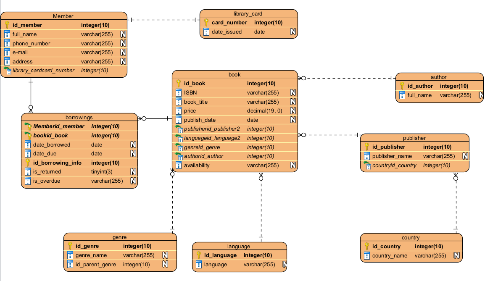
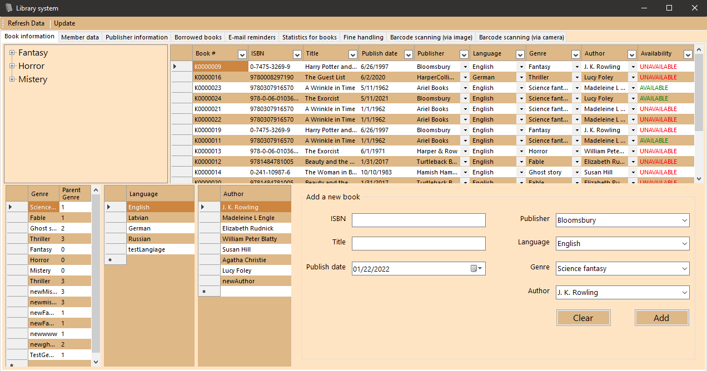

# Library
 WinForms app for a library PostGreSQL database, designed for book stock tracking and member registering.
 
Database ER (created in Visual Paradigm):

Provides functions such as - retrieving data from the database, adding new data, updating data, deleting data and filtering data by user set criteria.

App has total of 9 pages:

- Main page - Book information

 Contains all basic information for available books in the library. Shows availability status for each book (if it is available or unavailable).
 Implements a tree structure that shows parent - child relationships between genres. New genres can be added through the tree.

- Member data
 Provides main member registering functionality. During the registration of a new member, a card code gets generated for that specific person (for library identification      purposes).
 
- Publisher information
 Contains book publisher information
 
- Borrowed books
 Page, where borrowed books get registered. When a user starts borrowed book registration process, a member, book indetificator and borrow, due dates get provided.
 When registration is finished, borrowed books status automatically changes to "Unavailable". The opposite happens when a book gets registered as "Returned".
 
- E-mail reminders
 Displays a table of all overdue members and bulk sends reminder e-mails to these members e-mail addresses (using gmail.com SMTP server). 
  
- Statistics for books
 Shows statistics for all books in library (their total count and total count per genre). Can export this information to a PDF file.
   
- Fine handling
 Used for registering or removing a penalty for a member based on pre set conditions (such as fine reasons). Provides functionality for generating an invoice in a PDF file.
 
- Barcode scanning (via image)
  User can upload a .jpg file containing a barcode. Application scans this barcode. Book information for the result gets displayed in a table. Used for
  checking if a barcode has been correctly generated.
  
- Barcode scanning (via camera)
 Can scan a barcode using a camera. Displays information about the result.
 
 
